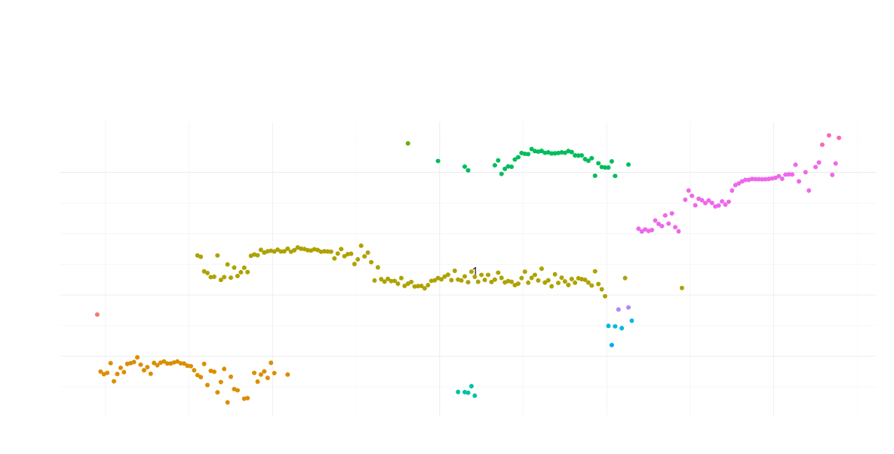
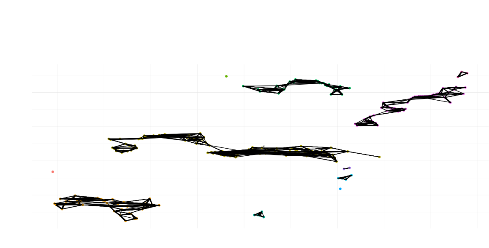

# Macha
Macha is an unpublished suite of tools for metabolomics analysis.  This includes novel algorithms for ROI detection for orbitrap data (webroi), baseline estimation for orbitrap data (ahull.baseline) and peak model estimation using skewed gaussian distributions (findcomponenets), fast peak grouping (dengroup and kernelsplit), and wrappers for warpgroup and mz.unity (warpgroup.nmacha unityme).

Originally intended to improve on the result quality of existing metabolomic workflows.  Ultimately I came to see the chromatographic-peak driven model of processing MS data as flawed and lost interest in this project.  Some of the code remains useful.


## Webroi Example




## Example Workflow


### Pseudocode, see file for full code

```R
{
devtools::install_github("nathaniel-mahieu/macha") #macha-machine token

library(macha)
library(data.table)

foreach (file = files, .packages = "macha", .errorhandling = "pass") %dopar% {
    cat(file)

    macha = rawdata(file, rbind(c(0, 400), c(400, 3000)))

    macha = findrois(macha, minlength = 15, ppm = 2, rtwid = 7)

    macha = baseline(macha, ppmwin = 3, lambda1 = 6, lambda2 = 7)

    saveRDS(macha, file = file.path("./", paste0(basename(file), ".macha.rds")))
}

# Cache findComponents
foreach (file = files, .errorhandling = "pass") %do% {
    cat("  ", file, "\n")

    macha = readRDS(file.path("./", paste0(basename(file), ".macha.rds")))

    macha = makeroicache(macha)

    .roil = foreach(r = unique(macha$r$r), .packages="macha") %dopar% {
        nextElem(getroi.iter(macha, r))
    }

    saveRDS(.roil, file = file.path("./", paste0(basename(file), ".macha_findcomponentsinput.rds")))
}

 foreach (file = files, .errorhandling = "pass") %do% {
    cat("  ", file, "\n")

    macha = readRDS(file.path("./", paste0(basename(file), ".macha.rds")))

    .roil = readRDS(file.path("./", paste0(basename(file), ".macha_findcomponentsinput.rds")))

    macha = findcomponents(
      macha, .roil = .roil,
      S = 3:7, seed.maxdensity=1/7, seed.maxdist=4, seed.sn.perpeak =c(Inf, 10, 7, 3, 2.5, 2), seed.sn.range = 3, seed.sn.adjust = 1, seed.minwidth = 4,
      unrelated.dist = 40, min.peakwidth = 3, sn.adjust.comp = 1, min.sharpness = 6E3, min.fracobs = .4, do.plot = F
    )

    saveRDS(macha, file = file.path("./", paste0(basename(file), ".macha.rds")))

    pdf(file = file.path("./", paste0(basename(file), ".macha.pdf")), width = 10, height = 10)
    try({
      for (i in 1:10) { plot.components(macha, sample(macha$r$r, 1)) }
      for (i in 1:10) { plot.components(macha, sample(which(macha$c$r %>% table >1) %>% names %>% as.numeric, 1)) }
    })
    dev.off()

  }


    gl = dengroup.ppm(Nmacha$m.c[,.(mz, rtpeak, intpeak)] %>% as.matrix, ppm = 2, rtwid = 1, minlength = 32)
    Nmacha$m.c[,g:=rep(seq_along(gl),sapply(gl, length))[order(unlist(gl))]]


    Nmacha = grtgmzcor(Nmacha, shaperng = 1, fracobs = .7)

    gl = dengroup.ppm(Nmacha$m.c[,.(mz.g, rtpeak.g, intpeak)] %>% as.matrix, ppm = 1, rtwid = 1, minlength = 1)


    warpgroup.nmacha_data_l = foreach(ug = ugs, .packages = "macha") %dopar% {
    f = nextElem(warpgroup.nmacha.iter(Nmacha, ug, maxdriftppm, maxdriftrt))
    gc()
    f
    }
    saveRDS(warpgroup.nmacha_data_l, paste0(filename_replicates, ".nmacha_data_l.rds"))

 # Warpgroup
  Nmacha = warpgroup.nmacha(Nmacha, ugs = ugs, warpgroup.nmacha_data_l = warpgroup.nmacha_data_l, sc.aligned.lim = 4, pct.pad = 0.1, min.peaks = min.peaks, maxdriftrt = 1, maxdriftppm = 1, fraccontrib = 0.6, refit.var = c(1.5, 0.25, 0.5), do.plot = F)
  saveRDS(Nmacha, paste0(filename_replicates, ".nmacha.rds"))


}
```